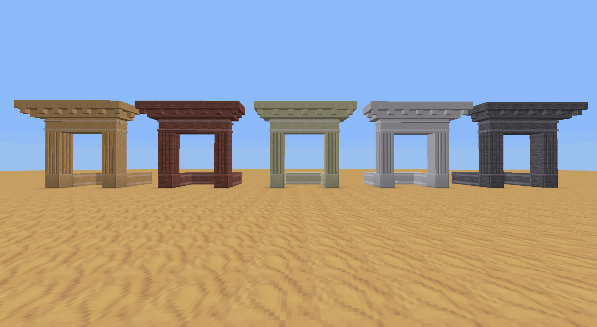
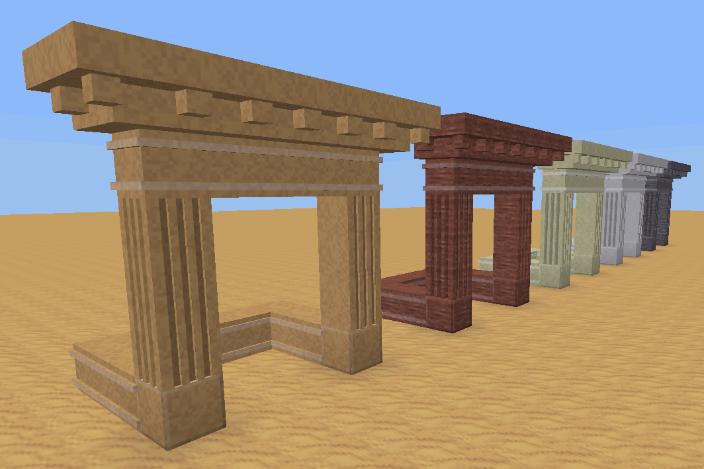
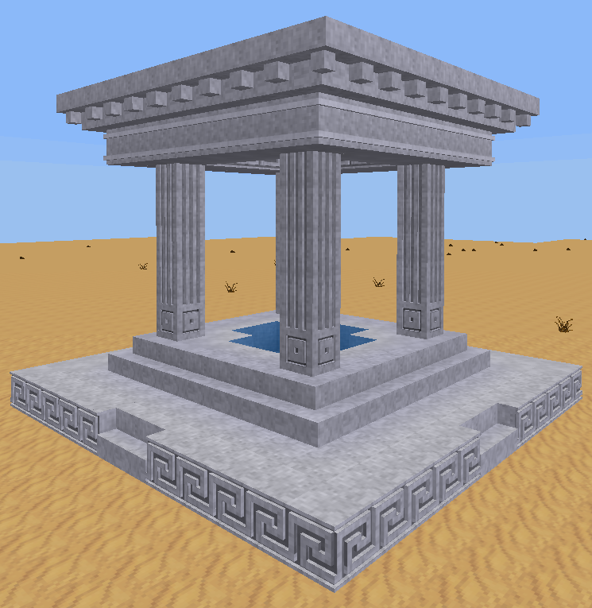
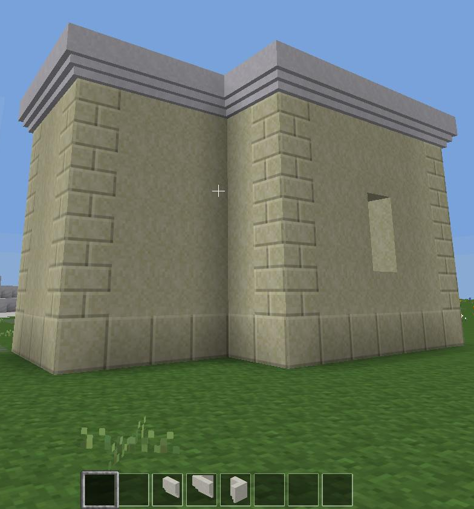

# Facade

Adds decorative clay and stone-type nodes to Minetest Game.

## Dependencies
- Luanti/Minetest >= 0.4.16
- default (included in minetest_game)
- Optional: [mychisel](https://github.com/minetest-mods/mychisel)
- Optional: [columnia](https://forum.luanti.org/viewtopic.php?t=9892)

## License
See [license.txt](license.txt) for details.

- Source code: LGPL 2.1+
- Media files: CC BY-SA 4.0

## References
- [facade ContentDB page](https://content.luanti.org/packages/TumeniNodes/facade/)
- [Luanti Forums post](https://forum.luanti.org/viewtopic.php?t=18208) for additional information
- [Mod installation instructions](https://docs.luanti.org/for-players/installing-mods/) (generic)

## Bugs, suggestions, features & bugfixes.
Report bugs or suggest ideas by [creating an issue](https://github.com/minetest-mods/facade/issues/new).
If you know how to fix an issue, or want something to be added, consider opening a Pull Request.

## Screenshots

